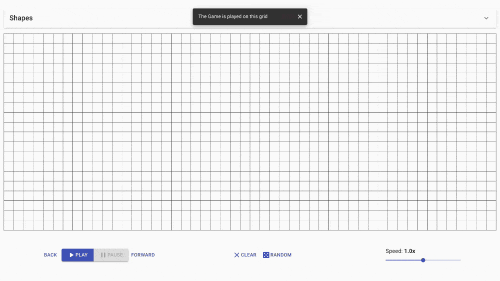
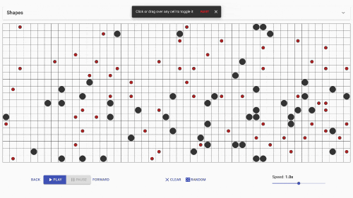

# Conway's Game of Life - a React App Visualizer

In a hurry? Visit the app directly at <https://thegame.wtf/>

The Game of Life is an algorithm meant to imitate cellular reproduction devised by the British mathematician John Conway in 1970.

It is a zero-player game, meaning that its evolution is determined by its initial state, requiring no further input. You play the Game of Life by creating an initial state of the field and watching what happens.

You'll find pre-determined shapes in the drawer at the top; drag and drop these onto the grid to start. The controls on the left guide the game, and the slider on the right controls the speed.

## The Game

[Click here to visit the app!](https://thegame.wtf/)

Select **_Take a Tour_** for the in-app tour.

## The Game is played on the central grid

Most of the action takes place here: the main grid of 1,000 cells.

## Click each cell to toggle it from inactive to active and back

You can also hold down the mouse and "paint" over multiple cells to set them all at once!

## Use the `Play` and `Pause` buttons to play and pause the Game

After setting any initial state you like, these buttons control the Game itself. You can change the state of the game at any point while paused.

## Reset the grid with the `Clear` button

This will empty the grid and reset its history, ready for a new initial state

Try the Random button for a completely random initial state!

## The `Forward` and `Back` buttons push the game one step in time forward and back, respectively

## Pre-determined shapes can be found in the `Shapes` drawer at the top of the interface

Each shape on its own creates interesting patterns (some going on forever) but can be combined - drag and drop them onto the grid to set them as part of an initial state.

## Control the speed of each step with the `Speed` slider in the bottom right hand corner

The slider can be changed at any time, even while the Game is being played
